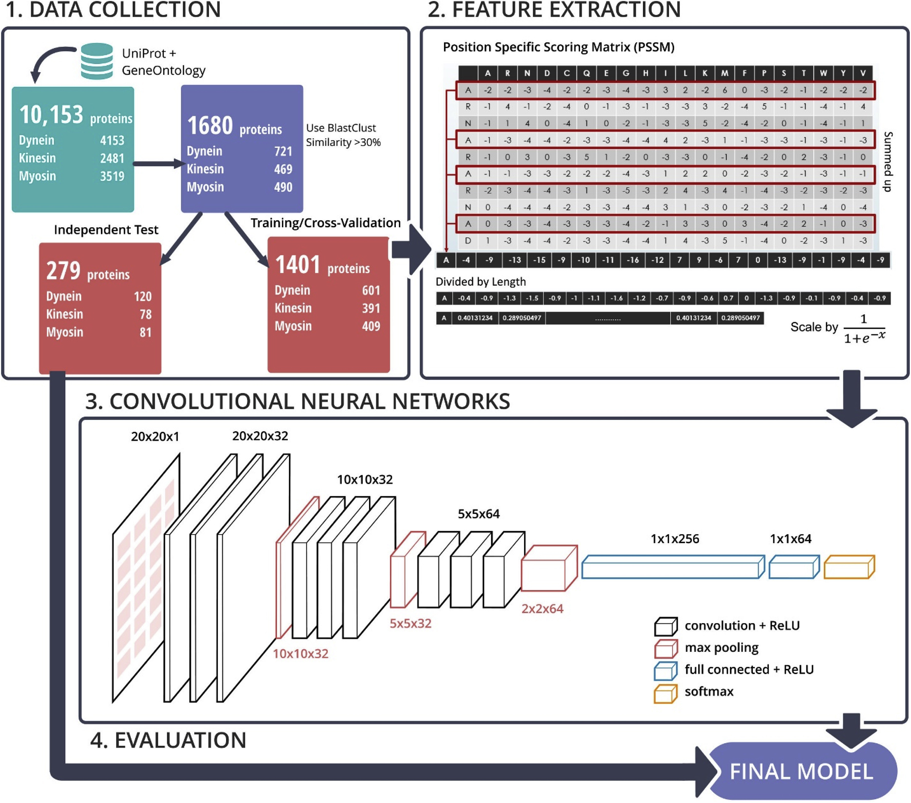

# Identifying molecular functions of cytoskeleton motor proteins using 2D convolutional neural network

Motor proteins are the driving force behind muscle contraction and are responsible for the active transportation of most proteins and vesicles in the cytoplasm. There are three superfamilies of cytoskeletal motor proteins with various molecular functions and structures: dynein, kinesin, and myosin. The functional loss of a specific motor protein molecular function has linked to a variety of human diseases, e.g., Charcot-Marie-Tooth disease, kidney disease. Therefore, creating a precise model to classify motor proteins is essential for helping biologists understand their molecular functions and design drug targets according to their impact on human diseases. Here we attempt to classify cytoskeleton motor proteins using deep learning, which has been increasingly and widely used to address numerous problems in a variety of fields resulting in state-of-the-art results. Our effective deep convolutional neural network is able to achieve an independent test accuracy of 97.5%, 96.4%, and 96.1% for each superfamily, respectively. Compared to other state-of-the-art methods, our approach showed a significant improvement in performance across a range of evaluation metrics. Through the proposed study, we provide an effective model for classifying motor proteins and a basis for further research that can enhance the performance of protein function classification using deep learning.

File:
- train_model_cv: train model with 5-fold cross-validation
- build_model.py: build model using 2D CNN on given dataset
- motor_load_model.py: load JSON model

# Citation
Please cite our paper as:
>Le, N. Q. K., Yapp, E. K. Y., Ou, Y. Y., & Yeh, H. Y. (2019). iMotor-CNN: identifying molecular functions of cytoskeleton motor proteins using 2D convolutional neural network via Chou's 5-step rule. *Analytical Biochemistry*, 575, 17-26. https://doi.org/10.1016/j.ab.2019.03.017.
